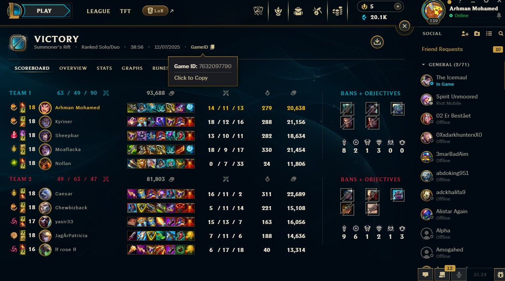

# League of Legends Match Search - Technical Assessment Project

A web application that fetches and displays post-game statistics for League of Legends matches using the Riot Games API. This project was developed as a technical assessment to demonstrate backend API integration, data parsing, and frontend development skills.

## 📹 Demo Video

**Demo Video**: [View Demo](static/vid/simple_html.mkv)

*Demo video showing the application in action. The video file is located at `static/vid/simple_html.mkv`.*

**Note**: For best viewing experience on GitHub, consider uploading the video to GitHub Releases or using a video hosting service like YouTube and embedding it here.

## 🎮 Match Reference



*This is the match reference that we tested on. The application successfully fetches and displays player statistics from this match.*

---

## 📋 Project Overview

This is a **League of Legends Match Search** application built as a technical assessment project. The application allows users to search for League of Legends matches by Match ID and view detailed post-game statistics for individual players.

### What's Inside

The project consists of:
- **Backend Server**: FastAPI-based REST API that fetches and parses match data from Riot Games API
- **Frontend**: HTML-based user interface with authentic League of Legends styling
- **Data Processing**: Automatic parsing of raw match data into clean, structured player statistics
- **Champion Icons**: 169 champion icons downloaded and stored locally for fast loading

### Frontend Versions

There are **2 versions** of the frontend:
1. **Simple HTML Version** (Current): A clean, functional HTML/CSS/JavaScript implementation with League of Legends styling
2. **Advanced Figma Design**: A more advanced design created in Figma (reference design available)

The current implementation uses the simple HTML version, which provides all core functionality with an authentic League of Legends aesthetic.

### AI-Assisted Development

**Important Note**: AI agents were used to speed up certain aspects of project development, but **NOT** in the core project idea or architecture. AI assistance was utilized for:
- **Champion Icons Download Script**: Automated script to download all 169 champion icons from Riot's Data Dragon CDN
- **Folder Path Restructuring**: Automated reorganization of project structure for better maintainability
- **Testing Endpoints**: Quick testing and validation of API endpoints
- **Code Optimization**: Minor code cleanup and optimization
- **Documentation**: Assistance with writing and formatting project documentation (README, code comments)

The core project idea, architecture design, API integration logic, data parsing algorithms, and frontend functionality were developed independently.

---

## 🚀 Quick Start Guide

### Step 1: Clone the Repository
```bash
git clone <repository-url>
cd LOL_Post_GameData
```

### Step 2: Create Virtual Environment
```bash
python -m venv venv
```

### Step 3: Activate Virtual Environment

**Windows:**
```bash
venv\Scripts\activate
```

**Linux/Mac:**
```bash
source venv/bin/activate
```

### Step 4: Install Dependencies
```bash
pip install -r requirements.txt
```

### Step 5: Add Your Riot API Key

#### Option A: Using .env file (Recommended)
1. Create a `.env` file in the root directory
2. Add your Riot API key:
   ```
   RIOT_API_KEY=your_api_key_here
   REGION=europe
   ```

#### Option B: Direct Configuration
Edit `src/main.py` and replace the default API key:
```python
RIOT_API_KEY = os.getenv("RIOT_API_KEY", "YOUR_API_KEY_HERE")
```

**How to Get a Riot API Key:**
1. Go to [Riot Developer Portal](https://developer.riotgames.com/)
2. Sign in with your Riot account
3. Create a new application
4. Copy your API key
5. **Note**: Development API keys expire after 24 hours. For production, you'll need a permanent key.

### Step 6: Start the Server
```bash
uvicorn src.main:app --reload
```

Or using the virtual environment directly:
```bash
venv\Scripts\uvicorn.exe src.main:app --reload
```

### Step 7: Open in Browser
Navigate to: **http://localhost:8000**

### Step 8: Use the Application
1. Enter a Match ID (e.g., `EUW1_1234567890`)
2. Click "Fetch Match"
3. Select a player from the dropdown
4. View their detailed statistics

---

## ✨ Features

- 🔍 **Match Search**: Fetch match data by Match ID
- 📊 **Player Statistics**: Display detailed post-game stats including:
  - Summoner Name
  - Champion Name with icons
  - Role icons (Top, Jungle, Mid, ADC, Support)
  - Kills, Deaths, Assists (KDA)
  - Gold Earned
  - Creep Score (CS)
  - Damage Dealt to Champions
  - Damage Taken
  - Win/Loss status
- 🎨 **Authentic UI**: League of Legends-inspired design with official fonts and colors
- 🖼️ **Champion Icons**: 169 champion icons stored locally for fast loading
- ⚡ **Fast API**: FastAPI backend with async operations
- 📱 **Responsive**: Works on desktop and mobile devices

---

## 📁 Project Structure

```
LOL_Post_GameData/
├── src/                          # Source code
│   ├── main.py                  # FastAPI backend server
│   ├── download_champions.py    # Script to download champion icons
│   └── champion_id_mapping.json # Champion name mapping
├── static/                       # Frontend assets
│   ├── index.html               # Frontend HTML page
│   ├── champions-icons/         # 169 champion icon images
│   ├── vid/                     # Demo videos
│   └── pic/                     # Reference images
├── venv/                        # Virtual environment (not in git)
├── requirements.txt             # Python dependencies
├── README.md                    # This file
└── .env                         # Environment variables (create this, not in git)
```

---

## 🔌 API Endpoints

- `GET /` - Serves the frontend HTML page
- `GET /match/{match_id}` - Returns raw match data from Riot API
- `GET /match/{match_id}/players` - Returns parsed player data for all players
- `GET /match/{match_id}/player/{player_index}` - Returns parsed data for a specific player (0-9)

---

## 🎯 Match ID Format

Match IDs typically follow this format:
- `{REGION}_{MATCH_ID}` (e.g., `EUW1_1234567890`, `NA1_9876543210`)

### Common Regions:
- `EUW1` - Europe West
- `EUN1` - Europe Nordic & East
- `NA1` - North America
- `KR` - Korea
- `BR1` - Brazil
- `LA1`, `LA2` - Latin America
- `OC1` - Oceania
- `RU` - Russia
- `TR1` - Turkey
- `JP1` - Japan

---

## 📝 Requirements

- Python 3.8+
- Riot Games API Key ([Get one here](https://developer.riotgames.com/))
- Internet connection for API calls

---

## ⚠️ Important Notes

- **API Rate Limits**: Riot Games API has rate limits. Be mindful of how many requests you make.
- **Match Availability**: Match data is only available for recent matches (typically within 2 years).
- **API Key Expiration**: Development API keys expire after 24 hours. You'll need to regenerate them.
- **Region Settings**: The application uses the Europe region by default. Change the `REGION` environment variable or in `src/main.py` to use a different region.

---

## 🛠️ Development

### Running in Development Mode
```bash
uvicorn src.main:app --reload --host 0.0.0.0 --port 8000
```

### Downloading Champion Icons
If you need to update champion icons:
```bash
python src/download_champions.py
```

---

## 📄 License

This project is for educational and assessment purposes. Make sure to comply with Riot Games API Terms of Service.

---

## 🙏 Acknowledgments

- Riot Games for providing the League of Legends API
- League of Legends community for inspiration
- Data Dragon CDN for champion assets
